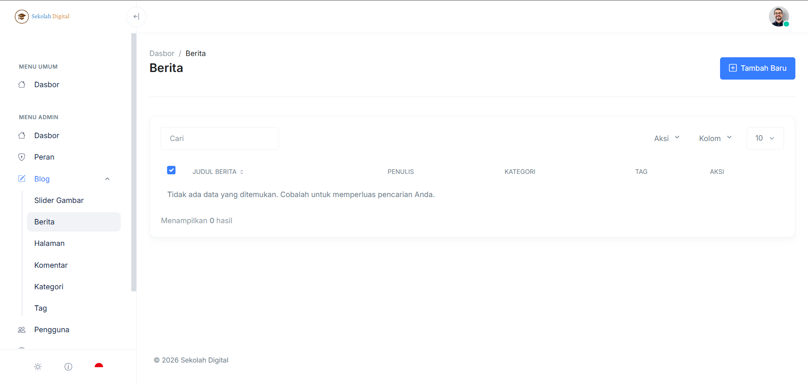
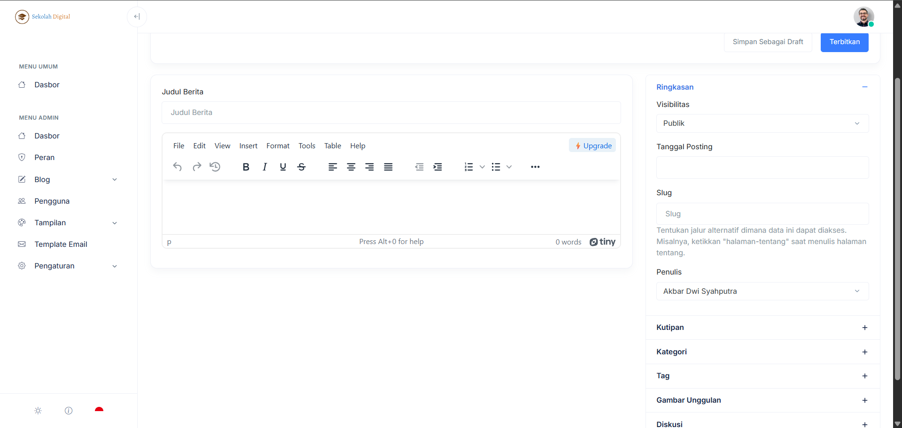

# Berita

Berita adalah fitur untuk menulis dan menerbitkan konten ke halaman publik sekolah.

Kamu bisa pakai modul ini untuk:

* pengumuman sekolah
* liputan kegiatan
* artikel edukasi
* info PPDB
* dan masih banyak lagi

### Alur cepat (dari kosong sampai tayang)



#### 1) Buat draft

Klik **Tambah Baru**, tulis judul dan isi berita, lalu klik **Simpan Sebagai Draft**.



#### 2) Rapikan identitas berita

Atur **Kategori**, **Tag**, **Gambar Unggulan**, dan **Slug**.



#### 3) Terbitkan

Jika sudah siap tampil ke publik, klik **Terbitkan**.



***

### Daftar Berita (halaman list)

Di halaman **Berita** kamu melihat tabel daftar artikel.

<figure><figcaption></figcaption></figure>

Yang penting di layar ini:

* **Cari**: filter cepat berdasarkan judul.
* Dropdown **Aksi**, **Kolom**, dan jumlah baris (mis. **10**).
* Kolom tabel:
  * **Judul Berita**
  * **Penulis**
  * **Kategori**
  * **Tag**
  * **Aksi** (Edit/Hapus)


Kalau muncul pesan **“Tidak ada data yang ditemukan”**, berarti belum ada berita atau filter pencarian terlalu spesifik.


***

### Editor Berita (halaman tambah/edit)

Editor berita terdiri dari dua area:

* **Area utama**: Judul + isi berita.
* **Sidebar kanan**: pengaturan publikasi dan metadata.

<figure><figcaption></figcaption></figure>

#### Area utama

**Judul Berita**

Tulis judul yang pendek dan jelas.

Contoh yang enak dibaca:

* `Jadwal PPDB Gelombang 1 Tahun 2026`
* `Kegiatan P5: Panen Hidroponik Bersama`

**Isi berita**

Kamu menulis isi berita di editor teks.

Saran struktur isi:

1. Paragraf pembuka (1–2 kalimat).
2. Poin penting (tanggal, lokasi, sasaran).
3. Detail tambahan.
4. Penutup + CTA (mis. kontak TU atau link form).

***

### Sidebar kanan: panduan tiap panel

#### Ringkasan

Panel ini menentukan apakah berita terlihat publik dan bagaimana identitasnya.

* **Visibilitas**
  * pilih **Publik** jika berita boleh tampil ke pengunjung.
* **Tanggal Posting**
  * isi tanggal agar urutan dan tampilan timeline konsisten.
* **Slug**
  * jalur URL berita.
  * idealnya singkat, huruf kecil, pakai `-`.
* **Penulis**
  * pilih akun penulis berita.


Hindari mengubah **slug** setelah berita sudah terlanjur tersebar.


#### Kutipan

Isi ringkasan singkat yang muncul sebagai preview.

Target aman: 1–2 kalimat.

#### Kategori

Pilih kategori utama berita.

Butuh bikin kategori baru? Lihat halaman [Kategori](kategori.md).

#### Tag

Tambahkan label topik untuk membantu pencarian.

Butuh aturan tag yang rapi? Lihat halaman [Tag](tag.md).

#### Gambar Unggulan

Ini gambar utama yang tampil di kartu berita dan halaman detail.

Rekomendasi cepat:

* pakai gambar landscape
* pastikan tidak pecah
* hindari teks kecil di gambar

#### Diskusi

Jika fitur diskusi/komentar aktif, atur dari panel ini.

***

### Draft vs Terbit



#### Draft

Cocok untuk:

* revisi bertahap
* menunggu persetujuan
* menulis dulu, rapikan nanti

Tombol: **Simpan Sebagai Draft**.



#### Terbit

Cocok untuk:

* berita sudah final
* gambar dan metadata sudah lengkap

Tombol: **Terbitkan**.



***

### Checklist sebelum klik “Terbitkan”

* [ ] Judul jelas dan tidak terlalu panjang.
* [ ] Isi berita punya paragraf pembuka.
* [ ] Kategori sudah dipilih.
* [ ] Tag 2–5 buah, tidak duplikat.
* [ ] Gambar unggulan sudah sesuai.
* [ ] Tanggal posting benar.
* [ ] Slug rapi (atau biarkan sistem membuat otomatis).

### Troubleshooting

#### Berita tidak muncul di halaman publik

* Pastikan status sudah **Terbit**.
* Pastikan **Visibilitas** = **Publik**.
* Cek **Tanggal Posting** (jangan jauh ke masa depan).

#### Gambar unggulan tidak tampil

* Upload ulang gambar.
* Coba ukuran file lebih kecil.
* Pastikan koneksi stabil.

#### Tidak bisa melihat menu Berita

Akun kamu mungkin tidak punya izin. Cek di [Hak Akses](../hak-akses.md).
