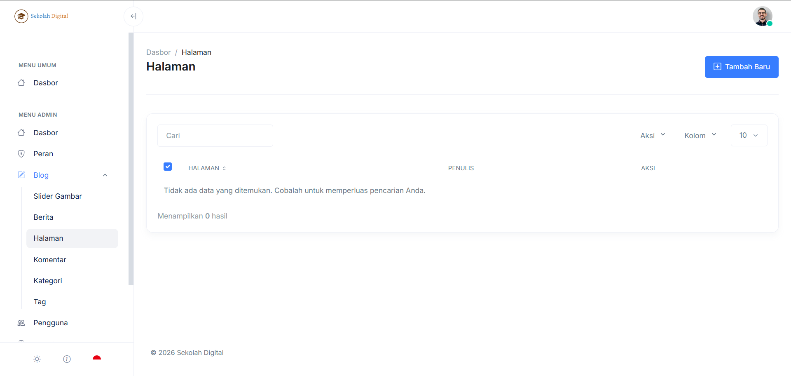
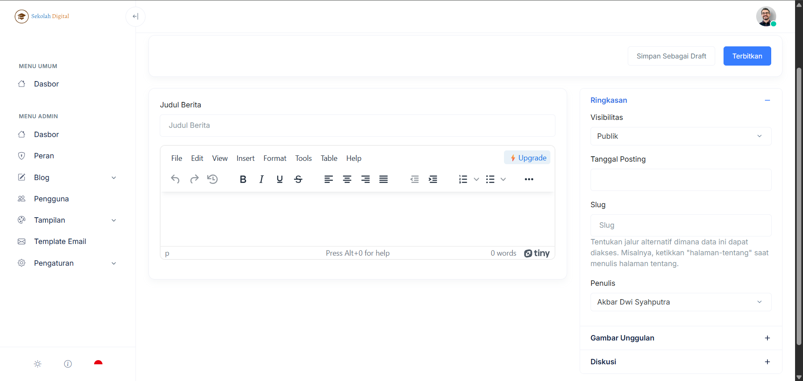

# Halaman

Halaman adalah konten **statis** di website sekolah.\
Cocok untuk konten yang jarang berubah.

Contoh penggunaan:

* Profil sekolah
* Visi & misi
* Struktur organisasi
* Kontak
* Panduan PPDB (versi tetap)


Bedanya dengan **Berita**:\
**Halaman** itu evergreen. **Berita** itu kronologis dan berbasis tanggal.


### Workflow paling cepat

Kalau kamu cuma butuh hasil jadi, ikuti ini:

1. Klik **Tambah Baru**.
2. Isi judul + konten.
3. Atur **Visibilitas** dan **Slug**.
4. Klik **Terbitkan**.

***

### 1) Daftar Halaman

Di layar **Halaman**, kamu mengelola daftar page yang sudah dibuat.

<figure><figcaption></figcaption></figure>

Yang tersedia di list:

* **Cari**: filter cepat berdasarkan judul halaman.
* Dropdown **Aksi**, **Kolom**, dan jumlah baris (mis. **10**).
* Kolom tabel:
  * **Halaman** (judul)
  * **Penulis**
  * **Aksi** (Edit/Hapus)


Kalau muncul pesan **“Tidak ada data yang ditemukan”**, berarti belum ada halaman atau kata kunci pencarian terlalu spesifik.


***

### 2) Editor Halaman (Tambah/Edit)

Editor halaman terdiri dari:

* **Judul** dan **konten** di area utama.
* Pengaturan publikasi di **sidebar kanan**.

<figure><figcaption></figcaption></figure>

#### Menulis konten yang nyaman dibaca

Coba pakai pola sederhana ini:

* 1 paragraf pembuka
* beberapa heading pendek
* bullet list untuk poin penting
* bagian kontak/CTA di akhir


Kalau halaman berisi jadwal atau syarat, pakai bullet list.\
Pembaca lebih cepat menangkap.


***

### 3) Sidebar kanan: arti setiap pengaturan

#### Ringkasan

Panel ini mengatur status tampil dan identitas halaman.

* **Visibilitas**
  * **Publik**: tampil ke pengunjung.
  * (opsi lain bisa muncul sesuai sistem/role)
* **Tanggal Posting**
  * gunakan jika sistem menampilkan urutan berdasar tanggal.
* **Slug**
  * jalur URL halaman.
  * contoh: `tentang-sekolah`, `kontak`, `ppdb`.
* **Penulis**
  * pilih akun penanggung jawab konten.


Slug sebaiknya ditetapkan sejak awal.\
Kalau sudah tersebar, ubah slug bisa membuat tautan lama putus.


#### Gambar Unggulan

Gambar utama untuk preview kartu/thumbnail (jika tema website menampilkan).

Rekomendasi:

* format landscape
* ukuran file tidak terlalu besar
* hindari teks kecil di gambar

#### Diskusi

Jika fitur diskusi/komentar aktif, atur dari panel ini.

***

### Draft vs Terbit (pilih sesuai kebutuhan)



Pakai **Simpan Sebagai Draft** kalau:

* masih butuh revisi
* konten menunggu persetujuan
* halaman belum siap ditampilkan



Pakai **Terbitkan** kalau:

* konten sudah final
* slug sudah benar
* visibilitas sudah sesuai



***

### Checklist sebelum terbit

* [ ] Judul jelas dan tidak kepanjangan.
* [ ] Konten punya heading dan poin-poin.
* [ ] Visibilitas sesuai (umumnya **Publik**).
* [ ] Slug rapi atau biarkan sistem mengisi.
* [ ] Gambar unggulan sudah sesuai (jika dipakai).

### Troubleshooting

#### Halaman tidak muncul di website

* Pastikan sudah klik **Terbitkan**.
* Pastikan **Visibilitas** = **Publik**.
* Jika ada cache, coba hard refresh / bersihkan cache browser.

#### Tidak bisa akses menu Halaman

Cek izin akun di [Hak Akses](../hak-akses.md).
