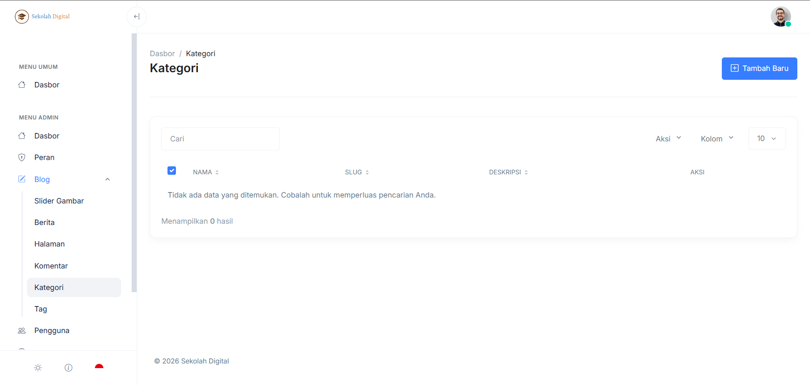
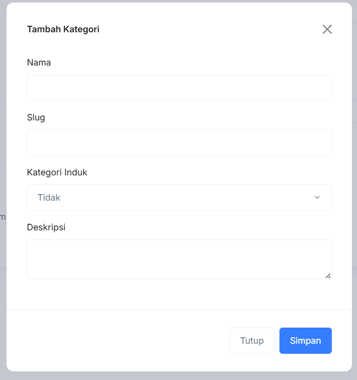

# Kategori

Kategori dipakai untuk mengelompokkan konten blog. Pikirkan kategori seperti “rak buku” untuk berita dan artikel.

### Masuk ke halaman Kategori

Arah cepatnya begini:

1. Masuk ke [dashboard-admin.md](../dashboard-admin.md "mention").
2. Buka **Admin → Blog → Kategori**.

### Yang Anda lihat di halaman ini

Halaman ini berisi tabel daftar kategori.

* **Tombol “Tambah Baru”** di kanan atas.
* **Kotak “Cari”** untuk menyaring kategori.
* Dropdown **Aksi**, **Kolom**, dan jumlah baris (mis. **10**) di kanan tabel.
* Tabel dengan kolom:
  * **Nama**
  * **Slug**
  * **Deskripsi**
  * **Aksi** (Edit/Hapus)


Kalau tabel kosong dan muncul pesan **“Tidak ada data yang ditemukan”**, berarti belum ada kategori atau filter pencarian terlalu spesifik.


<figure><figcaption></figcaption></figure>

### Konsep penting: Nama vs Slug

* **Nama**: teks yang terlihat oleh pengguna. Contoh: `Pengumuman`.
* **Slug**: versi URL yang rapi. Contoh: `pengumuman`.


Hindari mengubah **slug** kategori yang sudah dipakai banyak artikel. Perubahan slug bisa memengaruhi tautan yang sudah tersebar/terindeks di mesin pencari.


### Membuat kategori baru

Klik **Tambah Baru**. Form **Tambah Kategori** akan muncul.

<figure><figcaption></figcaption></figure>

Isi field berikut:

* **Nama**: nama kategori yang tampil di blog.
* **Slug**: versi URL yang rapi. Biasanya huruf kecil dan pakai tanda minus. (opsional, jika kosong maka akan di generate otomatis dari sistem)
* **Kategori Induk**: pilih induk jika kategori ini adalah sub-kategori.
  * Pilih **Tidak** jika tidak punya induk.
* **Deskripsi**: keterangan singkat untuk kebutuhan admin/SEO (opsional).

Terakhir, klik **Simpan**.


Gunakan **Kategori Induk** untuk struktur yang rapi. Contoh: `Kegiatan` → `Kegiatan Sekolah`.


### Mengubah kategori

1. Temukan baris kategori yang ingin diubah.
2. Klik **Edit** (ikon pensil) pada kolom **Aksi**.
3. Ubah field yang diperlukan (**Nama**, **Slug**, **Kategori Induk**, **Deskripsi**).
4. Simpan.

### Menghapus kategori

1. Temukan kategori.
2. Klik **Hapus** (ikon tempat sampah).
3. Konfirmasi.


Sebelum hapus, cek apakah ada artikel yang masih memakai kategori tersebut.


### Tips penamaan kategori

* Gunakan 1–3 kata.
* Hindari duplikasi makna (mis. `Info` dan `Informasi`).
* Batasi jumlah kategori. Lebih baik sedikit tapi jelas.

### Troubleshooting

#### Tidak bisa menambah kategori

* Pastikan akun Anda punya izin/hak akses untuk mengelola data kategori.
* Coba refresh halaman dan ulangi.

#### Data tidak muncul padahal sudah ada

* Kosongkan kolom **Cari**.
* Ubah jumlah baris (mis. dari **10** ke **25**).
