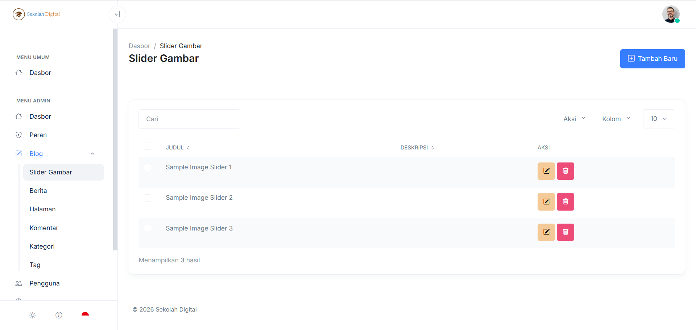

# Slider Gambar

Halaman **Slider Gambar** mengelola daftar gambar slider yang tampil di halaman publik (mis. beranda).

Setiap item slider biasanya berisi gambar, judul, dan deskripsi. Beberapa sekolah juga memakai link/target saat slider diklik.

### Cara akses

1. Masuk ke [dashboard-admin.md](../dashboard-admin.md "mention")
2. Buka menu **Admin → Blog → Slider Gambar**.

### Tampilan halaman

Halaman ini menampilkan tabel daftar slider.

<figure><figcaption></figcaption></figure>

### Komponen di halaman

* **Tombol “Tambah Baru”**: membuat slider baru.
* **Kolom “Cari”**: mencari slider berdasarkan judul.
* **Dropdown “Aksi”**: aksi massal untuk data terpilih (jika tersedia).
* **Dropdown “Kolom”**: atur kolom yang ditampilkan (jika tersedia).
* **Dropdown jumlah baris (mis. 10)**: mengubah jumlah data per halaman.
* **Tabel Slider**:
  * **Judul**: nama/label slider.
  * **Deskripsi**: teks singkat.
  * **Aksi**: tombol **Edit** (ikon pensil) dan **Hapus** (ikon tempat sampah).

### Tambah slider baru

1. Klik **Tambah Baru**.
2. Isi **Judul**.
3. Isi **Deskripsi** (opsional).
4. Upload **Gambar**.
5. Klik **Simpan**.


Pakai judul yang singkat. Pastikan gambar tidak blur saat ditampilkan.


### Edit slider

1. Cari slider yang ingin diubah.
2. Klik **Edit**.
3. Ubah judul/deskripsi/gambar.
4. Simpan perubahan.

### Hapus slider

1. Cari slider yang ingin dihapus.
2. Klik **Hapus**.
3. Konfirmasi penghapusan.


Setelah dihapus, slider tidak akan tampil di halaman publik.


### Pencarian dan pengelolaan daftar

#### Cari slider

1. Ketik kata kunci pada kolom **Cari**.
2. Daftar akan tersaring otomatis.

#### Ubah jumlah data per halaman

1. Klik dropdown jumlah baris (mis. **10**).
2. Pilih jumlah yang diinginkan.

### Troubleshooting

#### Gambar tidak tampil di halaman publik

* Pastikan item slider sudah tersimpan.
* Pastikan gambar berhasil terunggah.
* Muat ulang halaman publik dan bersihkan cache browser.

#### Tidak bisa upload gambar

* Pastikan ukuran file tidak terlalu besar.
* Pastikan kapasitas penyimpanan masih tersedia.
* Coba format umum: JPG/PNG.
* Coba upload ulang dengan koneksi internet stabil.
