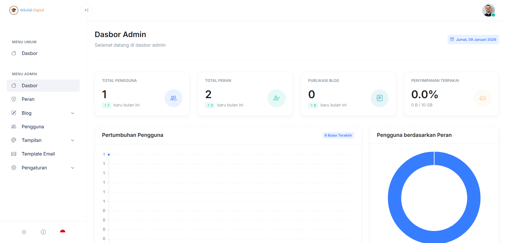

# Dashboard Admin

Dashboard Admin adalah halaman utama di admin panel. Di sini Anda melihat ringkasan informasi penting dan akses cepat ke fitur pengelolaan sekolah.

Tampilan dan menu yang muncul dapat berbeda, tergantung role/izin akun dan modul yang aktif.

<figure><figcaption></figcaption></figure>

### Cara akses

1. Masuk melalui halaman [Masuk](../autentikasi/masuk.md).
2. Setelah berhasil masuk, Anda akan melihat [dashboard-pengguna.md](../user-panel/dashboard-pengguna.md "mention")
3. Lalu klik **Admin Panel**, baru anda akan dialihkan ke dashboard admin seperti tampilan diatas.


Jika Anda sudah masuk tetapi tidak ada menu **Admin Panel** yang muncul di **Dashboard Pengguna**, berarti akun Anda tidak memiliki akses ke **Admin Panel**.


### Bagian yang ada di dashboard

Bagian di bawah ini mengikuti komponen yang tampil di dashboard Anda.

* **Menu**: daftar fitur yang bisa diakses sesuai role/izin.
* **Ringkasan**: kartu ringkasan data penting.


Fitur pada dashboard admin dapat berubah sesuai modul yang diaktifkan.

