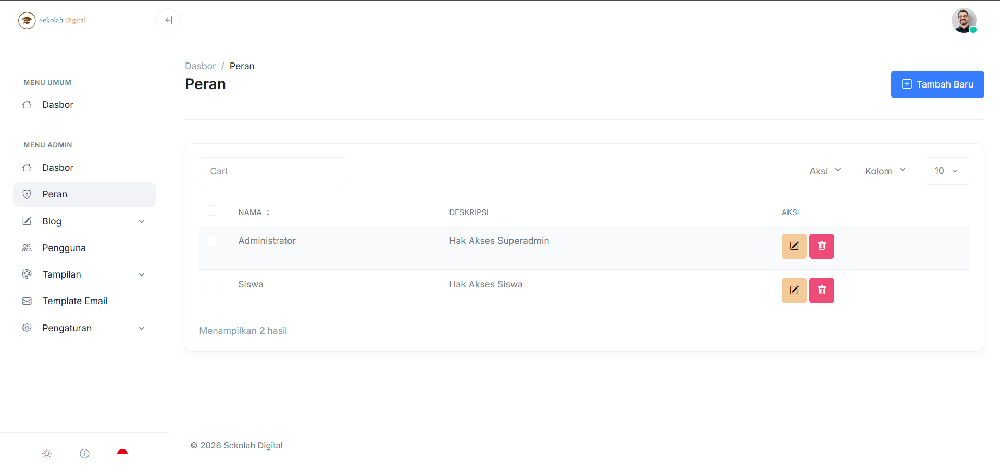
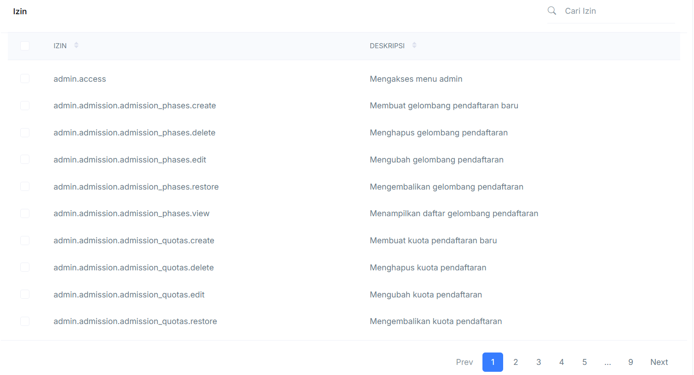

# Hak Akses

Halaman **Hak Akses** mengatur **Peran (Role)** di aplikasi.\
Peran menentukan menu dan aksi yang bisa diakses pengguna.

### Cara akses

1. Masuk ke [dashboard-admin.md](dashboard-admin.md "mention").
2. Buka menu **Admin → Peran**.

### Tampilan halaman

Di halaman ini Anda melihat daftar peran yang sudah dibuat.

<figure><figcaption></figcaption></figure>

### Komponen di halaman Peran

* **Tombol “Tambah Baru”**: membuat peran baru.
* **Kolom “Cari”**: mencari peran berdasarkan nama atau deskripsi.
* **Dropdown “Aksi”**: aksi massal untuk data terpilih (jika tersedia).
* **Dropdown “Kolom”**: atur kolom yang ditampilkan (jika tersedia).
* **Dropdown jumlah baris (mis. 10)**: mengubah jumlah data per halaman.
* **Tabel Peran**:
  * **Nama**: nama peran. Contoh: _Administrator_, _Siswa_.
  * **Deskripsi**: penjelasan singkat fungsi peran.
  * **Aksi**: tombol **Edit** dan **Hapus**.

### Tambah peran baru

1. Klik **Tambah Baru**.
2. Isi **Nama** peran.
3. Isi **Deskripsi** (opsional).
4. Pilih hak akses yang dibutuhkan (jika ada).\
   
5. Simpan perubahan.


Buat nama peran yang mudah dipahami. Hindari nama yang terlalu umum.


### Ubah (edit) peran

1. Cari peran yang ingin diubah.
2. Klik tombol **Edit** (ikon pensil).
3. Ubah nama, deskripsi, atau hak akses.
4. Simpan perubahan.

### Hapus peran

1. Cari peran yang ingin dihapus.
2. Klik tombol **Hapus** (ikon tempat sampah).
3. Konfirmasi penghapusan.


Hapus peran hanya jika sudah tidak dipakai oleh pengguna mana pun.


### Pencarian dan pengelolaan daftar

#### Cari peran

1. Ketik kata kunci pada kolom **Cari**.
2. Hasil akan menyaring daftar peran.

#### Ubah jumlah data per halaman

1. Klik dropdown jumlah baris (mis. **10**).
2. Pilih jumlah yang diinginkan.

### FAQ

#### Kenapa menu admin tidak muncul?

Akun Anda tidak punya role admin, atau izinnya dibatasi.

#### Kenapa peran tidak bisa dihapus?

Biasanya peran masih dipakai oleh pengguna, atau peran sistem.
