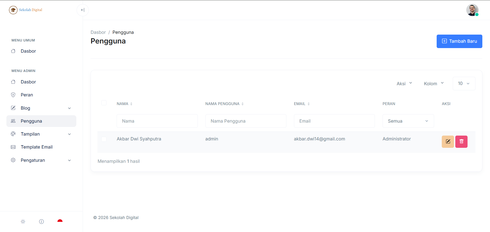

# Pengguna

Halaman **Pengguna** dipakai untuk mengelola akun yang bisa masuk ke sistem.

Di sini kamu bisa:

* menambah akun baru
* mengatur **peran** (role)
* mencari akun tertentu dengan cepat
* mengubah atau menghapus akun

<figure><figcaption></figcaption></figure>

### Cara akses

1. Masuk ke [dashboard-admin.md](dashboard-admin.md "mention").
2. Buka menu **Admin → Pengguna**.

***

### Kenali layar Pengguna (biar nggak nyasar)

Di bagian atas tabel kamu akan melihat kontrol ini:

* **Tambah Baru**: membuat akun pengguna.
* Dropdown **Aksi**: aksi massal untuk item yang dicentang (jika tersedia).
* Dropdown **Kolom**: atur kolom yang ditampilkan (jika tersedia).
* Dropdown jumlah baris (mis. **10**): mengatur jumlah data per halaman.

Di area tabel, kamu akan melihat:

* Checkbox di tiap baris: untuk memilih beberapa pengguna sekaligus.
* Kolom:
  * **Nama**
  * **Nama Pengguna** (username)
  * **Email**
  * **Peran**
  * **Aksi** (Edit/Hapus)

Selain itu ada filter cepat langsung di header:

* filter **Nama**
* filter **Nama Pengguna**
* filter **Email**
* filter dropdown **Peran**


Kalau hasilnya sedikit atau kosong, cek lagi filter di header kolom.\
Kadang filter tertinggal dari pencarian sebelumnya.


***

### Quick tasks



Gunakan filter di header kolom:

1. Isi salah satu field (Nama/Username/Email).
2. (Opsional) Batasi dengan dropdown **Peran**.
3. Tabel akan tersaring.

Tips:

* Cukup ketik sebagian. Mis. `akbar`.
* Kalau bingung kenapa kosong, kosongkan semua filter dulu.



1. Buka dropdown **Peran** di header tabel.
2. Pilih peran tertentu (mis. **Administrator**).
3. Untuk kembali normal, pilih **Semua**.



***

### Tambah pengguna

Klik **Tambah Baru**, lalu isi form yang muncul.

Field yang biasanya diminta:

* **Nama**
* **Nama Pengguna** (username)
* **Email**
* **Peran**


Pastikan role yang dipilih sudah benar.\
Role menentukan menu dan hak akses pengguna.


Butuh atur role? Lihat halaman [Hak Akses](hak-akses.md).

***

### Edit pengguna

1. Temukan pengguna yang ingin diubah.
2. Klik **Edit** (ikon pensil) pada kolom **Aksi**.
3. Ubah data yang diperlukan (mis. nama, email, atau peran).
4. Simpan.


Kalau kamu hanya ingin mengganti akses menu, fokus di field **Peran**.


### Hapus pengguna

1. Temukan pengguna.
2. Klik **Hapus** (ikon tempat sampah).
3. Konfirmasi.


Hapus akun bisa membuat pengguna kehilangan akses permanen. Pastikan akun tersebut memang tidak dipakai.


***

### Praktik yang disarankan

* Pakai email aktif. Ini mempermudah pemulihan akun.
* Hindari berbagi akun admin.
* Buat role spesifik (mis. `Operator Blog`) daripada memberi akses admin penuh.

***

### Troubleshooting

#### Tidak bisa melihat menu Pengguna

Akun kamu tidak punya izin admin. Cek di [Hak Akses](hak-akses.md).

#### Filter tidak bekerja / hasil selalu kosong

* Kosongkan semua filter kolom.
* Ubah dropdown **Peran** ke **Semua**.
* Refresh halaman.

#### Ada data tapi tidak muncul

* Naikkan jumlah baris (mis. dari **10** ke **25/50**).
* Pastikan tidak ada kolom yang disembunyikan via dropdown **Kolom**.
