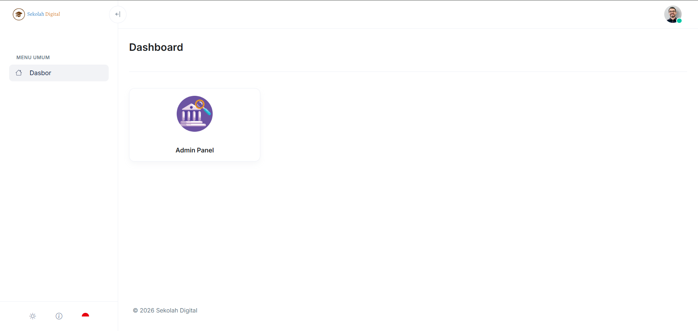

# Dashboard Pengguna

Dashboard Pengguna adalah halaman utama setelah Anda berhasil masuk. Di sini Anda melihat ringkasan informasi dan akses cepat ke fitur utama.

<figure><figcaption>
Dashboard Pengguna
</figcaption></figure>

Setelah Anda berhasil masuk ke sistem, Anda akan melihat dashboard pengguna seperti gambar diatas. Pada dashboard ini Anda akan melihat menu yang sesuai dengan hak akses dari akun yang Anda gunakan.

### Cara akses

1. Silahkan masuk melalui halaman [Masuk](../autentikasi/masuk.md).
2. Jika berhasil, Anda akan dialihkan otomatis ke **Dashboard Pengguna**.

### Bagian yang ada di dashboard

Bagian di bawah ini mengikuti komponen yang tampil di dashboard Anda.&#x20;

* **Menu**: menampilkan menu sesuai dengan hak akses dari akun yang digunakan.


Fitur pada dashboard ini belum terlalu lengkap, fitur akan bertambah sesuai dengan tahap pengembangan / jika ada modul baru yang diaktifkan.


### Troubleshooting

#### Dashboard kosong atau data tidak muncul

* Muat ulang halaman dan coba masuk ulang.
* Pastikan koneksi internet stabil.
* Pastikan akun Anda sudah terdaftar dan aktif.

#### Tidak bisa melihat menu tertentu

* Menu bisa disembunyikan karena role atau izin.
* Hubungi administrator sekolah untuk pengecekan akses.
